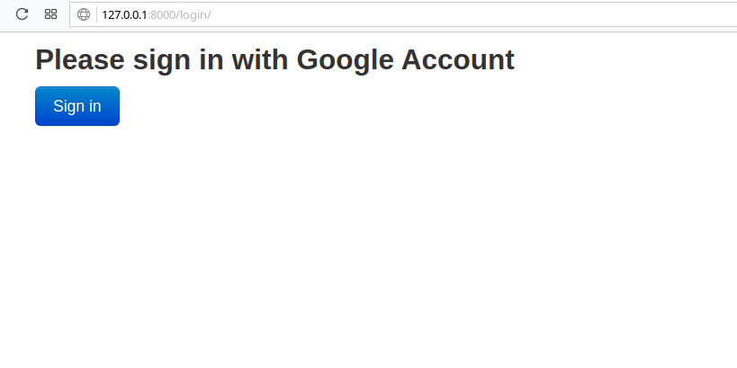
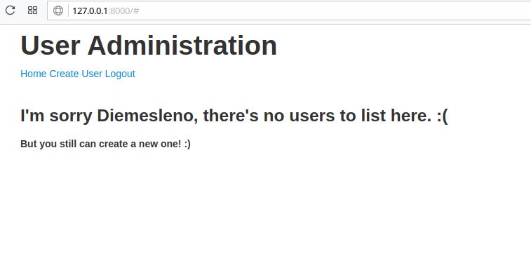
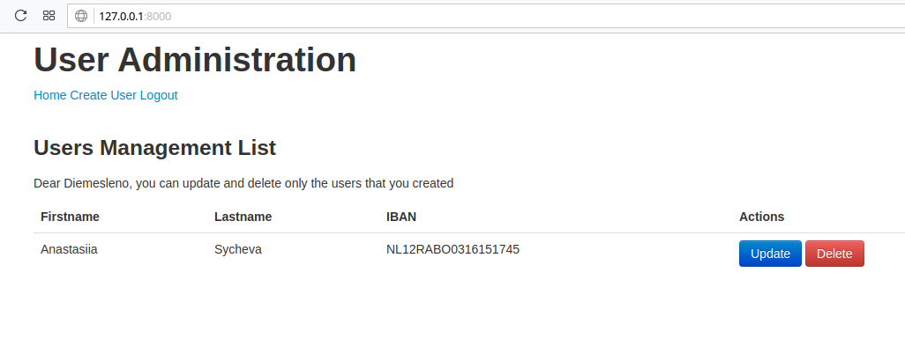

# Django CRUD for testing 
> Simple CRUD using Google Auth. 

![PyPi][python-image]
![PyPi][status-image]
![Dockbit][deploy-image]
![Wercker][build-image]

It is possible to create an account using Google Authentication and after that
create and manage users.

## Technologies utilized
* Python 3.6.4
* Django 2.0.2
* PostgreSQL 9.5+

### User Administration

Please implement a small Django application to manage (CRUD) users and their bank 
account data (IBAN). Required fields are first name, last name and IBAN. 
Data should be validated.

### TODO

- [x] Administrators of the app should authenticate using a Google account
- [x] Administrators should be able to create, read, update and delete users
- [x] Restrict manipulation operations on a user to the administrator who created them 
- [x] Use PostgreSQL as the database backend
- [x] Use Python 3.x
- [x] Write documentation on how to setup, run and use your implementation


### Test Environment

Set up a virtual machine environment using vagrant (provisioned by Puppet/Salt/Ansible/Bash - whatever suits you best) or docker-compose to run the test task including some short documentation.

## Installation

Any Operating System:

```sh

git clone https://github.com/diemeslen0/dcrud

cd dcrud

docker-compose run web python manage.py makemigrations

docker-compose run web python manage.py migrate

docker-compose up

access http://127.0.0.1:8000

Authentication with Google Account will create a user with superuser power (administrator). 
With this power you can create new users without giving them admin permissions. 
ou can see all users (non admin), but you can manage only your own ones.
```

## Login Page


## User Logged with no users created


## User logged with user created


## Release History
* 0.1.0
    * Dockerfile e Docker-Compose
* 0.0.9
    * Templates
* 0.0.8
    * User Views
* 0.0.7
    * User Form
* 0.0.6
    * User Model
* 0.0.5
    * User URLS
* 0.0.4
    * Project URLS
* 0.0.3
    * Application user creation
* 0.0.2
    * Settings configuration
* 0.0.1
    * Project creation

## Meta

Diemesleno Souza Carvalho – [@diemesleno](https://twitter.com/diemesleno) – diemesleno@gmail.com

Distributed under the ![AUR][gpl-image] license. 

[https://github.com/diemeslen0/dcrud](https://github.com/diemeslen0/)

[python-image]: https://img.shields.io/pypi/pyversions/Django.svg?style=flat-square
[gpl-image]: https://img.shields.io/aur/license/yaourt.svg?style=flat-square
[status-image]: https://img.shields.io/pypi/status/Django.svg?style=flat-square
[build-image]: https://img.shields.io/wercker/ci/wercker/docs.svg
[deploy-image]: https://img.shields.io/dockbit/DockbitStatus/health.svg?token=TvavttxFHJ4qhnKstDxrvBXM&style=flat-square
